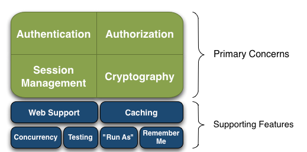
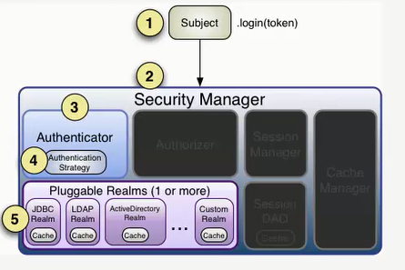
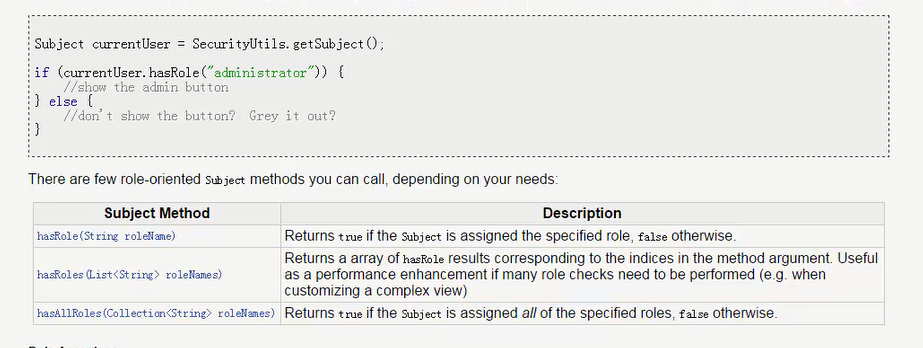

# Shiro
### 目录

1. [ShiroHello](#ShiroHello)
    - [ShiroHello的搭建（身份认证）](#ShiroHello的搭建)
2. [Introduction](#introduction)
	- [简介](#简介)
    - [三大组件](#三大组件应用)
 
3. [认证流程](#认证流程)
    
4. [连接数据库](#连接数据库配置)


5. [权限认证](#权限认证)
    - [编程方式授权](#编程方式授权)
    - [注解方式授权](#注解方式授权)


## ShiroHello
# 一、ShiroHello的搭建
> 1、读取配置文件，初始化工厂

> 2、获取SecurityManager实例

> 3、SecurityManager绑定到SecurityUtils

> 4、获取到当前的用户

> 5、创建令牌 用户名/密码
```

public class HelloWorld {
    public static void main(String[] args) {
        //1、读取配置文件，初始化工厂
        Factory<SecurityManager> factory=new IniSecurityManagerFactory("classpath:shiro.ini");
        //2、获取SecurityManager实例
        SecurityManager securityManager=factory.getInstance();
        //3、SecurityManager绑定到SecurityUtils
        SecurityUtils.setSecurityManager(securityManager);
        //4、获取到当前的用户
        Subject currentUser =SecurityUtils.getSubject();
        //5、创建令牌 用户名/密码
        UsernamePasswordToken token=new UsernamePasswordToken("wby","123");
        //6、
        try{
            currentUser.login(token);
            System.out.println("身份验证成功");
        }catch (AuthenticationException a){
            a.getStackTrace();
            System.out.println("身份验证失败");
        }

    }
}


```
# 二、Introduction
#### 简介
> Apache Shiro是一个强大且易用的Java安全框架,执行身份验证、授权、密码和会话管理。使用Shiro的易于理解的API,您可以快速、轻松地获得任何应用程序,从最小的移动应用程序到最大的网络和企业应用程序。


#### 三大组件应用

 |Subject|SecurityManager |Realm|
 | :-----   |  :-----   |  :-----   | 
 |当前用户的安全操作|Shiro通过SecurityManager来管理内部组件实例，并通过它来提供安全管理的各种服务| Realm充当了Shiro与应用安全数据间的“桥梁”或者“连接器”。也就是说，当对用户执行认证（登录）和授权（访问控制）验证时，Shiro会从应用配置的Realm中查找用户及其权限信息|
 
 
 # 三、认证流程
 
 > 认证/授权基本步骤：
 

 
  |认证/授权基本步骤|
  | :-----   | 
  | 1. 获取当前的 Subject，调用SecurityUtils.getSubject()|
  | 2. 判断当前用户是否已经认证，调用 Subject 的 isAuthenticated();|
  | 3. 或没有被认证，则把用户名和密码封装为 UserNamePassworkToken 对象|
  | 4. 执行登录，调用 Subject 的 login(AuthencationToken);|
  | 5. 自定义Realm 方法，从数据库中获用户安全数据|


 #  四、链接数据库配置

>表结构见sql目录 

```
[main]
jdbcRealm=org.apache.shiro.realm.jdbc.JdbcRealm
dataSource=com.mchange.v2.c3p0.ComboPooledDataSource
dataSource.driverClass=com.mysql.jdbc.Driver
dataSource.jdbcUrl=jdbc:mysql://localhost:3306/db_shiro
dataSource.user=root
dataSource.password=root
jdbcRealm.dataSource=$dataSource
securityManager.realms=$jdbcRealm


```

 
 
 # 五、权限认证
 
 > ### 基于角色的访问控制（编程时授权）
 
 
 
 ```$xslt
shiro_realm.ini
[users]
wby=123,role1
hrb=123,role1,role2

  public  void testRole() {
        Subject currenUser=ShiroUtil.login("classpath:shiro_role.ini","wby","123");
        //判断用户是否有该角色
        System.out.println(currenUser.hasRole("role1")+""+ currenUser.hasRole("role2"));
        System.out.println();
        //底层for循环调用hasRole
        boolean[] results=currenUser.hasRoles(Arrays.asList("role1","role2","role3"));
        System.out.println(results[0]);
        System.out.println(results[1]);
        System.out.println(results[2]);
        //只要一个不存在就是false
        boolean result=currenUser.hasAllRoles(Arrays.asList("role1","role2","role3"));
        System.out.println(result);
    }


```
 
  > ### 基于权限的访问控制（编程时授权）

 
```$xslt


  @Test
    public  void testRole() {
        Subject currenUser=ShiroUtil.login("classpath:shiro_permission.ini","wby","123");
        //判断用户是否有该权限
        System.out.println(currenUser.isPermitted("user:select")); //true
        System.out.println(currenUser.isPermitted("user:delete"));  //false

    }
    
    
    [users]
    wby=123,role1
    hrb=123,role1,role2
    [roles]
    role1=user:select
    role2=user:add,user:update,user.delete
```

 

 
> ### 注解方式授权

 |@RequiresAuthentication|@RequiresGuest|@RequiresPermissions("account:create")|@RequiresRoles("administrator")|@RequiresUser RequiresUser|
 | :-----   |  :-----   |  :-----   |  :-----   |   :-----   | 
 |要求当前 Subject 已经在当前的 session 中被验证通过才能被访问或调用。|要求当前的 Subject 是一个"guest"，也就是说，他们必须是在之前的 session 中没有被验证或被记住才能被访问或调用|) 要求当前的 Subject 被允许一个或多个权限，以便执行注解的方法|) 要求当前的 Subject 被允许一个或多个权限，以便执行注解的方法|) 要求当前的 Subject 被允许一个或多个权限，以便执行注解的方法|

 
 
 
 